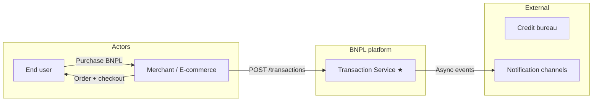
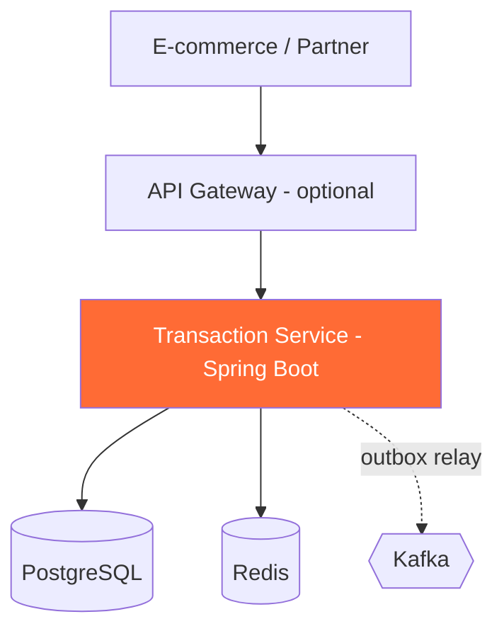
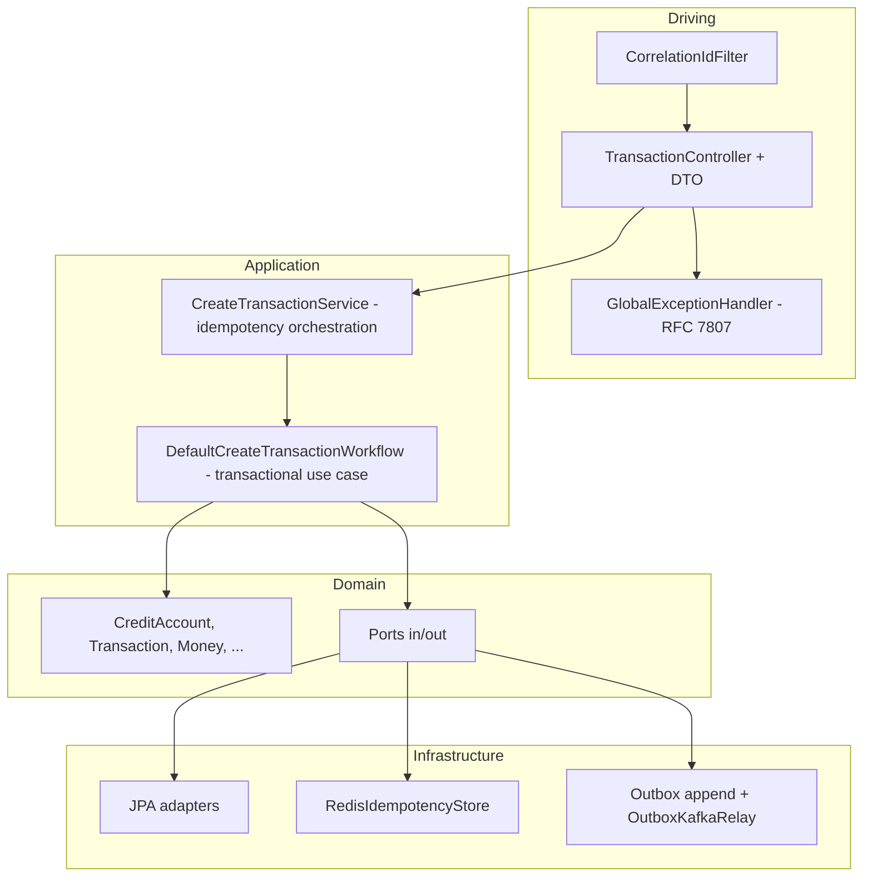
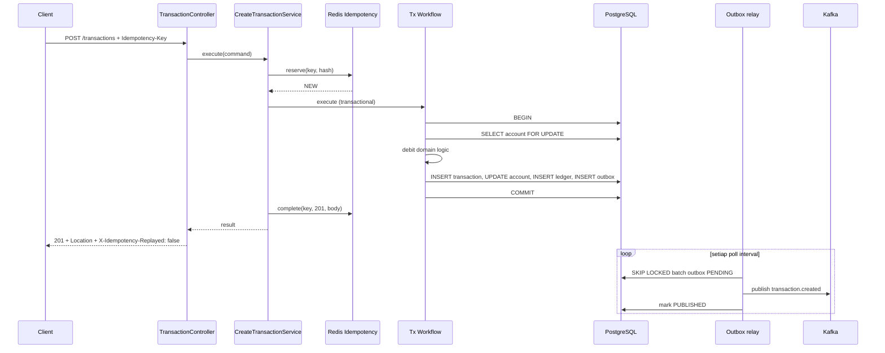

# Architecture — Transaction Service (BNPL)

Repositori ini memfokuskan implementasi pada **Transaction Service**; layanan lain (Identity, Credit Engine, Notification) digambarkan sebagai konteks dan dependensi.

---

## 1. Konteks bisnis

**Tanggung jawab Transaction Service (implementasi di repo ini):**

- Mencatat transaksi BNPL (**debit** `available_limit`) dengan konsistensi kuat (ACID).
- **Idempotency** pada API agar retry aman (tidak double debit).
- **Ledger** append-only untuk audit trail saldo per baris transaksi.
- **Outbox** agar publikasi event ke Kafka konsisten dengan commit database.

---

## 2. Arsitektur konteks (C4 Level 1 — disederhanakan)

| Aktor / sistem | Interaksi |
|----------------|-----------|
| E-commerce / merchant SDK | Memanggil API Gateway → Transaction Service |
| Identity Service | (Nanti) validasi user / token — di repo ini belum di-wire JWT penuh |
| Credit Engine | Keputusan kredit & limit; Transaction Service diasumsikan dipanggil setelah approval |
| PostgreSQL | System of record transaksi, akun, ledger, outbox |
| Redis | Cache idempotency (hot path) |
| Kafka | Event `transaction.created` untuk notifikasi, analitik, audit async |

---

## 3. Container diagram (C4 Level 2)

**Keputusan teknologi**

| Komponen | Pilihan | Alasan singkat |
|----------|---------|----------------|
| DB transaksi | PostgreSQL | ACID, constraint, `FOR UPDATE`, mature untuk finansial |
| Idempotency | Redis + key TTL | Lookup cepat, `SETNX` atomik |
| Messaging | Kafka | Throughput, retention, consumer groups |
| API errors | RFC 7807 `ProblemDetail` | Standar industri, tooling client |

**Bootstrap Kafka (dev):** aplikasi di **host** biasanya memakai `KAFKA_BROKERS=localhost:9094` (listener EXTERNAL di `docker-compose`); di dalam Docker network memakai `kafka:9092`.

---

## 4. Di dalam Transaction Service (C4 Level 3 — hexagonal)

**Aturan hexagonal:** paket `domain` tidak mengimpor Spring / JPA / Kafka / Redis. Implementasi port ada di `infrastructure` dan `application`.

---

## 5. Alur utama: create transaction (happy path)

---

## 6. Model data (ringkasan)

Lihat migrasi Flyway `V1`–`V4` untuk DDL lengkap.

| Tabel | Peran |
|-------|--------|
| `credit_accounts` | Limit & `available_limit` per user (aggregate persisten) |
| `transactions` | Header transaksi; `external_ref` & `idempotency_key` unik |
| `ledger_entries` | Baris buku besar (append-only) + `balance_after` |
| `outbox_events` | Outbox pattern: payload event + status `PENDING` / `PUBLISHED` / `FAILED` |
| Seed `V5` | Akun demo untuk E2E lokal |

**Konkurensi:** `findByUserIdForUpdate` memetakan ke `PESSIMISTIC_WRITE` agar dua debit bersamaan pada akun yang sama diserialisasi.

---

## 7. Idempotency

1. Hash canonical dihitung dari field bisnis permintaan (bukan dari nilai header key itu sendiri).
2. Redis: `SET key ... NX` + TTL; status `PROCESSING` → `COMPLETED` + body cache.
3. Konflik: key sama, hash beda → **409** (`idempotency-conflict`).
4. Gagal di tengah: `markFailed` menghapus key agar klien bisa retry dengan key sama.

---

## 8. Strategi database (soal assessment)

| Kebutuhan | Teknologi | Alasan |
|-----------|-----------|--------|
| Saldo, transaksi, ledger, outbox | **PostgreSQL (RDBMS)** | ACID, integritas referensi, locking |
| Idempotency hot path | **Redis** | Latency rendah, TTL bawaan |
| Riwayat event panjang | **Kafka** | Append-only log, replay, desacoupling |

---

## 9. Topik Kafka (layanan ini)

| Topik | Producer | Catatan |
|-------|----------|---------|
| `transaction.created` | Outbox relay | Payload JSON domain event; key = `aggregateId` |

Konfigurasi: `app.kafka.topics.transaction-created` di `application.yml`.

---

## 10. Keamanan & kepatuhan (outline)

- Tidak menyimpan **NIK** mentah di Transaction Service pada scope ini; hindari log field PII.
- Uang: `NUMERIC(19,4)` / `BigDecimal`, hindari `double`.
- Error response: tidak mengekspos stack trace ke klien (`server.error.*` dibatasi).

---

## 11. Observabilitas

- **Logging:** pola MDC `traceId` (dari `X-Correlation-Id`).
- **Actuator:** `/actuator/health`, `/actuator/prometheus`.
- **OpenAPI:** `openapi.yaml` di root + springdoc runtime `/v3/api-docs`.

---

## 12. Referensi file di repo

| Artefak | Path |
|---------|------|
| Kontrak API (OpenAPI 3) | **`openapi.yaml`** |
| Panduan menjalankan & curl | **`README.md`** |
| Dokumen ini | **`docs/architecture.md`** |
| Uji E2E manual | `scripts/e2e-curl.sh` |

